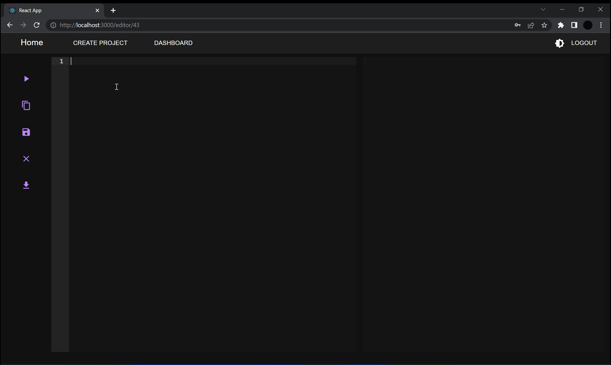

# Text Editor

---

Live demo http://20.111.36.171/register

A simple text editor built with [django](https://www.djangoproject.com/),
[django-rest-framework](https://www.django-rest-framework.org/) and [react](https://reactjs.org/). 




# Setup

---

Clone the repository.

From <code>text_editor_api</code> folder run:

```
python -m venv env 
env/Scripts/activate
pip install -r requirements.txt
```

Edit <code>db.cnf</code> file with your database credentials.

```
python manage.py makemigrations
python manage.py migrate
python manage.py runserver
```

From <code>frontend</code> folder run:

```
npm i
npm start
```

